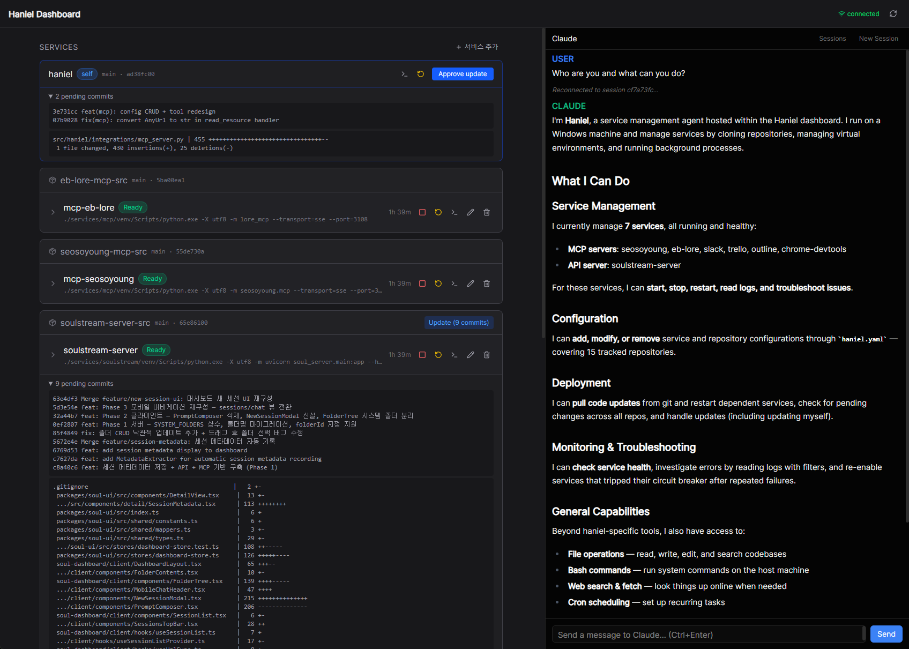

# haniel

**A service runner that your AI agent can operate.**

haniel manages processes, polls git repos, and exposes everything through [MCP](https://modelcontextprotocol.io/) —
so Claude Code can deploy, restart, monitor, and configure your services through natural conversation.

```
You:    "Deploy the latest changes to api-server"
Claude: haniel_pull(repo="api") → haniel_restart(service="api-server")
        ✅ Pulled 3 commits, api-server restarted successfully.
```

<p align="center">
  
</p>

[](https://github.com/eiaserinnys/haniel/actions/workflows/test.yml)

## The problem

You have a few services running on a machine. You want to:
- Deploy by pulling from git, not by building Docker images
- Let your AI agent handle routine ops (restart, rollback, check logs)
- See what's happening from a dashboard

Existing tools don't quite fit:

| Tool | Gap |
|------|-----|
| **PM2 / systemd** | No AI interface. Agent must generate shell commands and parse text output. |
| **Docker Compose** | Assumes containerized workflows. Overkill when you just want to `git pull` and restart. |
| **Coolify / CapRover** | Full PaaS with their own deployment model. You're adopting a platform, not a tool. |

haniel is a **single YAML file** + a process that your AI agent already knows how to talk to.

## How it works

1. **You write `haniel.yaml`** — repos to poll, services to run, how they depend on each other
2. **haniel runs as a service** — polls git, manages processes, restarts on crash
3. **Claude Code connects via MCP** — every operation is a tool call, not a shell command

```yaml
# haniel.yaml
poll_interval: 60

repos:
  backend:
    url: https://github.com/you/backend.git
    branch: main
    path: ./.services/backend

services:
  api:
    run: python -m uvicorn app:main --port 8000
    cwd: ./.services/backend
    repo: backend
    hooks:
      post_pull: pip install -r requirements.txt
```

That's it. haniel watches the repo, pulls changes, runs the hook, and restarts the service.

## Features

- **Git polling** — watches repositories, pulls on new commits
- **Process management** — start, stop, restart with dependency ordering
- **Lifecycle hooks** — `pre_start` and `post_pull` (installs, builds, migrations)
- **Health monitoring** — crash detection, exponential backoff, circuit breaker
- **MCP server** — full control surface via Streamable HTTP
- **Web dashboard** — real-time UI with Claude Code chat panel
- **Runtime config** — add/update/remove services without restart
- **Self-update** — two-loop architecture for updating its own code
- **Webhooks** — Slack, Discord, or JSON on deploys and failures

## Quick start

### Install

```powershell
# PowerShell as Administrator (Windows 10+, Python 3.11+)
irm https://raw.githubusercontent.com/eiaserinnys/haniel/main/install-haniel.ps1 | iex
```

### Connect Claude Code

```json
{
  "mcpServers": {
    "haniel": {
      "type": "http",
      "url": "http://localhost:3200/mcp/http"
    }
  }
}
```

Now Claude Code can operate your infrastructure:

```
"What services are running?"          → haniel://status
"Show me api-server logs"             → haniel_read_logs(service="api-server")
"Restart the worker"                  → haniel_restart(service="worker")
"Pull and deploy backend"             → haniel_update(service="api")
"Add a new service"                   → haniel_create_service_config(...)
```

## Self-update

haniel solves the "surgeon can't operate on themselves" problem with a two-loop design:

```
WinSW (Windows service)
  └── haniel-runner.ps1  (outer loop — survives updates)
       └── haniel run    (inner loop — the actual service)
```

When haniel detects changes to its own repo, it exits with code 10.
The outer loop runs `git pull` + `pip install` and relaunches.

## Documentation

- [Configuration Reference](docs/configuration.md)
- [Specifications](docs/specifications.md)
- [ADR-0001: WinSW over NSSM](docs/adr/0001-winsw-over-nssm.md)
- [ADR-0002: Self-update architecture](docs/adr/0002-self-update-architecture.md)
- [ADR-0003: Directory structure](docs/adr/0003-directory-structure.md)

## Development

```bash
git clone https://github.com/eiaserinnys/haniel.git
cd haniel
pip install -e ".[dev]"
pytest
```

Dashboard frontend (React):

```bash
cd dashboard
pnpm install && pnpm run build
```

## License

MIT
